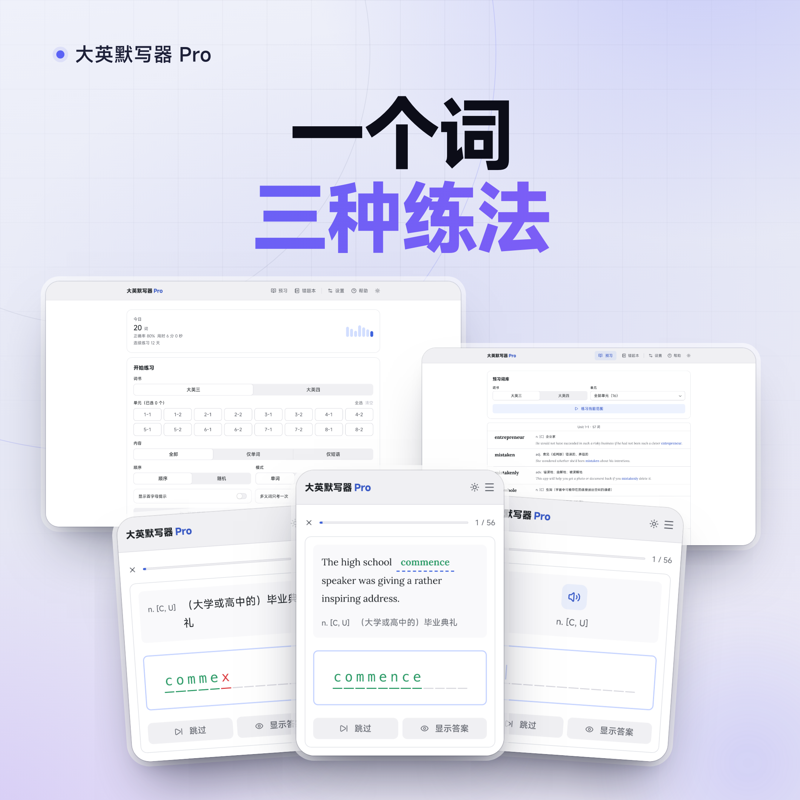

<div align="center">

# 大英默写器 Pro

**面向 ZJU 大英课程的单词、短语练习工具**

纯前端 · 免账号 · 无后端 · 数据只留在你的浏览器

</div>

<br>

| 一个词，三种练法 | 一个字母，都不放过 | 错过的，不会再错 |
| :---: | :---: | :---: |
| [](./pics/01-three-modes.png) | [](./pics/02-every-letter.png) | [](./pics/03-wrong-book.png) |
| 默写 · 听写 · 例句填空 | 逐字母判分，错误即标红 | 错题自动收录并优先复习 |

应用以 Next.js 静态导出，无需账号或后端；词库随项目提供，错题本、学习记录和设置保存在当前浏览器。

## 功能

### 练习

- **大英三 / 大英四**：选择一个或多个单元，也可组合练习。
- **三种练习**：看释义默写、听发音默写、例句填空。例句题按句中实际形式作答，例如过去式或复数形式。
- **筛选与排序**：练全部内容、仅单词或仅短语；顺序或随机出题。
- **多义词选项**：默认每个释义各出一道题；也可以让每个单词只出一道题，并选择提示首条释义或全部释义。例句填空仍按释义出题。

### 反馈与纠错

- **逐字母反馈**：正确字母标绿、错误字母标红；可退格修正。作答过程中打错后再改正的词仍会记入错题本。支持首字母提示、显示答案和跳过；键盘音效默认开启，可在设置中关闭。
- **错题与掌握**：错题及错误次数按单词累计；复习时错得较多的词优先。可标记已掌握，之后也能取消。
- **学习统计**：查看今日练习数、首次正确率、用时、连续练习天数和近期记录。

### 词库与语音

- **词库预习**：按词书和单元浏览词条；查看词性、中文与英文释义、例句，点击单词朗读，也可从当前范围直接开始练习。
- **语音与显示偏好**：支持国内和国际两个 Edge TTS provider，国内节点默认启用，可选择服务、英文音色和语速；设置中的「练习」可分别开关语音朗读和键盘音效。关闭练习朗读时，听写题改为显示释义提示，词库朗读和设置页试听仍可使用。分别设置英文解释和例句的显示方式；支持深色模式。
- **本地备份**：导出或导入错题本、已掌握词、学习记录和偏好，方便迁移设备。

## 页面

| 地址 | 内容 |
| --- | --- |
| `/` | 今日概览，选择词书、单元与练习选项 |
| `/browse` | 预习和筛选词库 |
| `/practice` | 当前练习 |
| `/result` | 本轮成绩 |
| `/wrong-words` | 错题本和已掌握词 |
| `/settings` | 语音、显示、键盘音效和数据备份 |
| `/help` | 应用内帮助 |

练习链接会带上词书、单元和选项，可分享相同的练习配置。成绩页链接也包含本轮成绩。逐题输入和当前进度只保存在应用运行期间的内存里；整页刷新会依据链接参数重新开始本轮。

## 本地运行

需要 Node.js 和 npm。

```bash
npm install
npm run dev       # http://localhost:3300
```

## 检查与构建

```bash
npm run typecheck  # TypeScript 类型检查
npm run check:data # 词库数据检查
npm test           # 词库检查 + node:test 单元测试
npm run build      # 静态导出到 out/
npm run start      # 本地托管 out/，先运行 build
```

构建产物中的路由结构为 `out/<route>/index.html`。部署到提供静态文件的 Web 服务器即可。

当前词库通过 `/data/...` 绝对路径加载，因此站点应部署在域名根路径；部署到子路径时需要同时适配 Next.js 路由、静态资源和词库 fetch 路径。不要直接双击 `out/index.html`，浏览器的 `file://` 协议无法按应用使用的方式加载 JSON。

## 数据与隐私

词库文件位于 `public/data/`，每本词书的单元由 `index.json` 列出。错题本、学习记录和设置使用浏览器 `localStorage`；朗读文本会按需发送到设置中选择的 Edge TTS provider。

本版本只接受当前数据结构，不会迁移旧 localStorage；如果检测到不匹配，页面会提供明确的本地数据重置操作。更换设备前，可在「设置 → 数据」导出备份。

## 维护词库

日常维护词库时直接编辑 `public/data/` 下的 JSON，并运行 `npm run check:data`。

```json
[
  {
    "english": "example",
    "senses": [
      {
        "pos": "n.",
        "zh": "例子",
        "en": "a thing characteristic of its kind",
        "examples": ["This is an [[example]]."]
      }
    ]
  }
]
```

词性属于释义；没有词性时 `pos` 可为 `null`。例句挖空用 `[[...]]` 标记，标记中的单词形式就是答案。新增词书时还要更新 `public/data/index.json`；词书显示名记录在 `public/data/index.json`。

## 项目结构

```text
app/                 Next.js 路由、根布局与全局样式
components/          客户端页面视图与交互组件
lib/                 词库、会话、引擎、本地存储、统计和备份
pics/                README 展示用海报
public/data/         运行时词库 JSON
scripts/             词库校验工具
tests/               node:test 单元测试
```

面向仓库编码代理的架构说明与实现约定见 [`AGENTS.md`](./AGENTS.md)。
